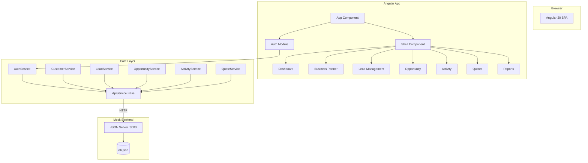
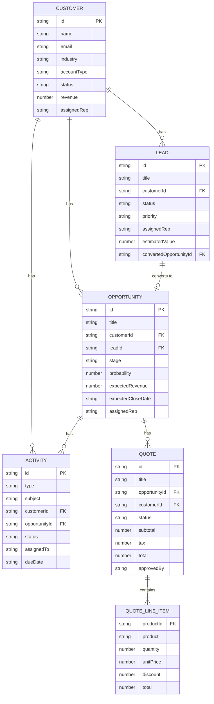
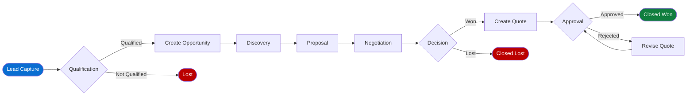
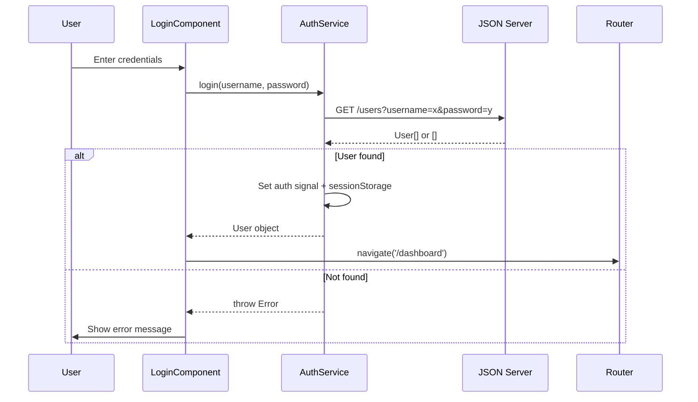
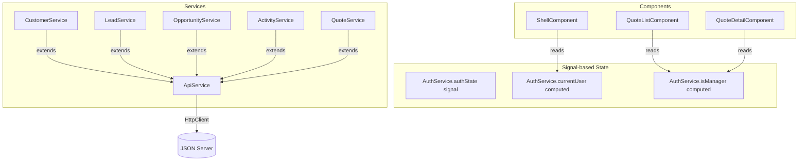
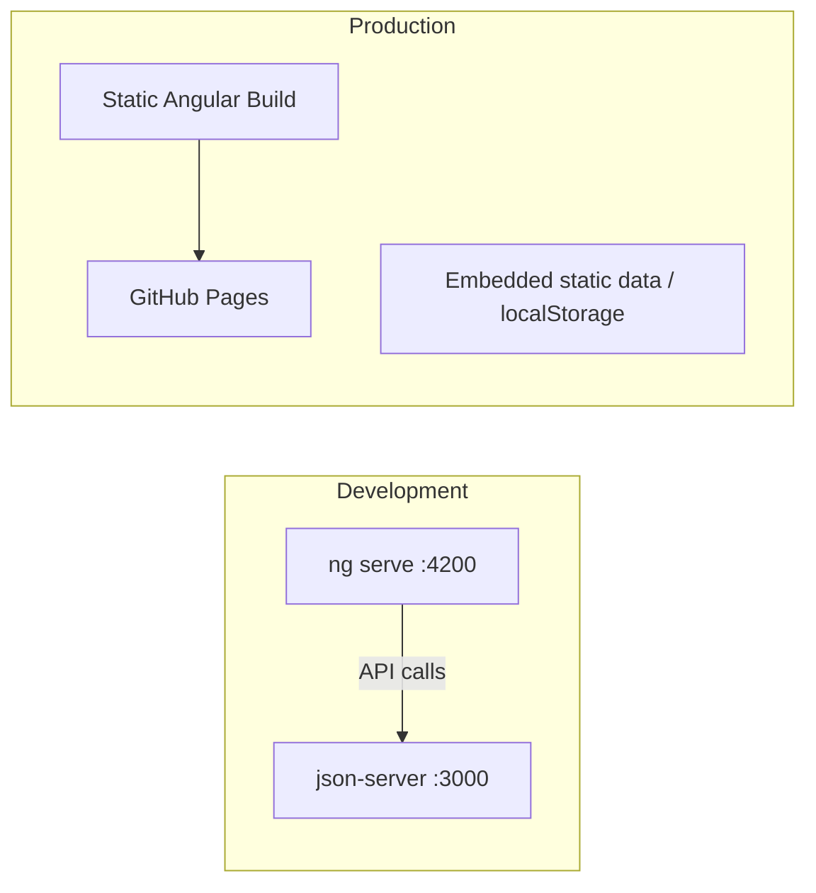

# Architecture Documentation

## SAP CRM Sales Process Simulator

---

## Application Architecture Overview

---

## Module Structure

```mermaid
graph LR
    subgraph Lazy Loaded Modules
        A[auth] -->|/auth/login| L[LoginComponent]
        B[business-partner] -->|/customers| BL[BpListComponent]
        B --> BF[BpFormComponent]
        B --> BD[BpDetailComponent]
        C[lead-management] -->|/leads| LL[LeadListComponent]
        C --> LF[LeadFormComponent]
        C --> LD[LeadDetailComponent]
        D[opportunity] -->|/opportunities| OL[OppListComponent]
        D --> OF[OppFormComponent]
        D --> OD[OppDetailComponent]
        E[activity] -->|/activities| AL[ActivityListComponent]
        E --> AF[ActivityFormComponent]
        F[quotes] -->|/quotes| QL[QuoteListComponent]
        F --> QF[QuoteFormComponent]
        F --> QD[QuoteDetailComponent]
        G[reports] -->|/reports| R[ReportsComponent]
    end
```

---

## Data Model

---

## SAP CRM Sales Process Flow

---

## Authentication Flow

---

## Component Communication Pattern

---

## Deployment Architecture

