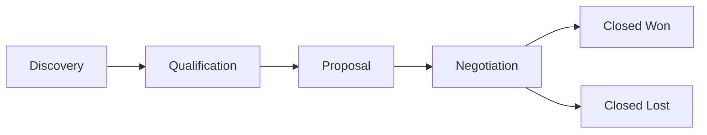

# SAP CRM Concepts Reference

This document maps standard SAP CRM objects and terminology to the features implemented in this simulator.

---

## Business Partner (BP)

In SAP CRM, a **Business Partner** is the central master data object representing any person or organization the company does business with.

### BP Categories
| Category | Simulated As | Description |
|---|---|---|
| Organization | Customer (Company) | Corporate accounts |
| Contact Person | Lead Contact | Individual contacts within an account |

### BP Roles
| SAP Role | Simulator Role |
|---|---|
| Prospect | Customer with status "Inactive" or new leads |
| Customer | Customer with status "Active" |
| Sold-to Party | Customer linked to a Quote |

### Key Fields Implemented
- **BP ID** (e.g. BP-001) — unique identifier
- **Account Type** — Enterprise / Mid-Market / SMB
- **Industry** — sector classification
- **Revenue** — annual revenue
- **Assigned Rep** — responsible sales representative
- **Address** — street, city, state, country

---

## Lead

A **Lead** in SAP CRM represents unqualified interest from a prospect — the earliest stage of the sales cycle.

### Lead Statuses
```
New → Qualified → Converted → Lost
```

| Status | Meaning |
|---|---|
| New | Freshly captured, not yet assessed |
| Qualified | Vetted by sales rep as worth pursuing |
| Converted | Turned into an Opportunity |
| Lost | Disqualified — not worth pursuing |

### Lead Sources (Implemented)
- Trade Show, Website, Referral, Cold Call, Partner, Email Campaign, LinkedIn, Industry Event, Inbound

### Lead-to-Opportunity Conversion
When a lead is Qualified, the sales rep can click **Convert to Opportunity**, which:
1. Sets lead status to `Converted`
2. Creates a linked Opportunity ID
3. Navigates to the new Opportunity form

---

## Opportunity

An **Opportunity** represents a qualified sales deal in progress. It tracks the probability of winning and forecasted revenue.

### Opportunity Stages (Sales Funnel)


| Stage | Default Probability | Description |
|---|---|---|
| Discovery | 20% | Initial requirements gathering |
| Qualification | 40% | Budget/authority/need confirmed |
| Proposal | 60% | Formal proposal submitted |
| Negotiation | 80% | Final terms being agreed |
| Closed Won | 100% | Deal won |
| Closed Lost | 0% | Deal lost to competitor |

### Revenue Forecast
**Weighted Pipeline Value** = Expected Revenue × (Probability / 100)

This is used in the Dashboard KPI and Reports to show a realistic forecast.

---

## Activity

**Activities** in SAP CRM track all interactions with customers and prospects throughout the sales process.

### Activity Types
| Type | Icon | Use Case |
|---|---|---|
| Call | 📞 | Phone calls, discovery calls, check-ins |
| Meeting | 👥 | Face-to-face, virtual demos, workshops |
| Email | 📧 | Follow-ups, proposals, confirmations |
| Task | ✅ | Internal work items, prep tasks |

### Activity Statuses
```
Scheduled → In Progress → Completed
                        → Cancelled
```

### Activity Management Best Practices (Simulated)
- Every customer interaction should be logged as an Activity
- Activities link to both a Customer and an Opportunity
- Completed activities should have an Outcome documented
- Upcoming activities drive the sales rep's daily work queue

---

## Quote

A **Quote** (or Sales Quotation) in SAP CRM is a formal document sent to a customer outlining the proposed products/services and pricing.

### Quote Approval Workflow
```
Draft → Submitted → Approved
                  → Rejected → (Revise) → Submitted
```

| Status | Actor | Action |
|---|---|---|
| Draft | Sales Rep | Create and edit quote |
| Submitted | Sales Rep | Submit for manager approval |
| Approved | Sales Manager | Approve and send to customer |
| Rejected | Sales Manager | Reject with reason, rep revises |

### Pricing Components (Implemented)
| Component | Calculation |
|---|---|
| Line Total | Quantity × Unit Price × (1 − Discount%) |
| Subtotal | Sum of all line totals |
| Discount | Sum of all line discounts |
| Tax | Subtotal × Tax Rate% |
| **Grand Total** | **Subtotal + Tax** |

### Role-Based Access
- **Sales Rep**: Create, edit Draft quotes; submit for approval
- **Sales Manager**: Approve or reject Submitted quotes

---

## Campaign (Attribution)

While full Campaign Management is not simulated, each Lead tracks a **Campaign** field to attribute lead sources. This maps to SAP CRM's **Campaign Management** module.

---

## SAP Fiori Design Language

The UI follows [SAP Fiori design principles](https://experience.sap.com/fiori-design-web/):

| Principle | Implementation |
|---|---|
| Role-based | Different UI controls for Manager vs Rep |
| Adaptive | Responsive layout (mobile + desktop) |
| Simple | Clean typography, minimal chrome |
| Coherent | Consistent status badges, icon usage |
| Delightful | Hover animations, smooth transitions |

### Color Palette
| SAP Color | Hex | Usage |
|---|---|---|
| SAP Blue | `#0a6ed1` | Primary actions, links |
| Shell Blue | `#354a5e` | Navigation sidebar |
| SAP Green | `#107e3e` | Success, approved, won |
| SAP Red | `#bb0000` | Error, rejected, lost |
| SAP Gold | `#e8a000` | Warning, in-progress |
| SAP Orange | `#e76500` | High priority |
